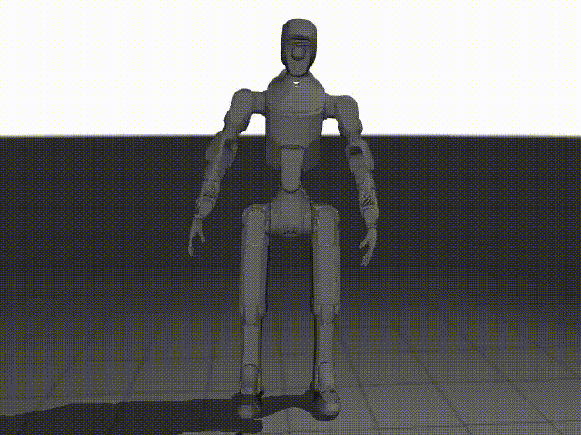

# deep-robotics-retarget

[中文](README_cn.md)

<p align="center">
  
</p>

## 1. Overview

deep-robotics-retarget is a Python toolkit that uses inverse kinematics (IK) to retarget human motion data to humanoid robot joint configurations. It supports multiple human motion data sources and provides real-time visualization based on MuJoCo. Currently, the project supports the DR02 Pro robot model.

This project is modified from the [GMR](https://github.com/YanjieZe/GMR/tree/master) project.

## 2. Features

- **Multiple Input Sources**: Supports SMPLX, BVH (Lafan1 / Nokov), and other motion capture formats
- **Two-Stage IK Solving**: Orientation-only tracking followed by combined position + orientation tracking
- **Collision Avoidance**: Optional self-collision and floor collision avoidance
- **Body Scaling**: Automatic mapping of human body proportions to the robot
- **Real-Time Visualization**: MuJoCo-based viewer with human motion overlay
- **Batch Processing**: Dataset-scale motion retargeting

## 3. Supported Robots

| Robot | Status |
|-------|--------|
| DR02 Pro | ✅ Supported |

The framework is designed to be extensible. To add a new robot:

1. Add the robot's MuJoCo XML to `assets/`
2. Create an IK configuration JSON in `general_motion_retargeting/ik_configs/`
3. Register the robot in `general_motion_retargeting/params.py`

### 3.1 Key Dependencies

- `mujoco` — Physics simulation and visualization
- `mink` — Inverse kinematics solver
- `smplx` — SMPL-X body model (installed from [GitHub](https://github.com/vchoutas/smplx))
- `qpsolvers[proxqp]` — QP solver for IK
- `redis[hiredis]` — Real-time streaming

## 4. Data Preparation

### 4.1 SMPLX Model

Download the body model from the [SMPL-X](https://smpl-x.is.tue.mpg.de/) official website. It is recommended to download the SMPL-X with removed head bun (NPZ, 392MB) version. Extract and place it in the `assets/body_models/smplx/` folder:

```
assets/body_models/smplx/
├── SMPLX_NEUTRAL.npz
├── SMPLX_FEMALE.npz
└── SMPLX_MALE.npz
```

> [!NOTE]
> This project uses `npz` model files by default. If you downloaded `pkl` format files from the SMPL-X website, you need to change the `ext` parameter in the `create()` function within the `smplx` library's `smplx/body_model.py` from the default value `npz` to `pkl`, or convert the `pkl` files to `npz` format.

### 4.2 AMASS Data

Download raw data from [AMASS](https://amass.is.tue.mpg.de/) to any location. Make sure to select bodies as `SMPL-X G` or `SMPL-X N`. It is recommended to place it under `source_data/AMASS/`. For quick start, two sample files are provided in `source_data/AMASS_demo/`.

### 4.3 LAFAN1 Data

Download raw BVH files from the [LAFAN repository](https://github.com/ubisoft/ubisoft-laforge-animation-dataset) ([lafan1.zip](https://github.com/ubisoft/ubisoft-laforge-animation-dataset/blob/master/lafan1/lafan1.zip)), extract and place them under `source_data/lafan1/`. For quick start, two sample files are provided in `source_data/lafan1_demo/`.

### 4.4 Nokov Data

Capture the required data using Nokov motion capture equipment. For quick start, three sample files are provided in `source_data/nokov_demo/`.

## 5. Installation

### 5.1 Requirements

- Python == 3.11
- Linux (Ubuntu 22.04 / 24.04 recommended)

### 5.2 Install Steps

> [!NOTE]
> This project has been tested on Ubuntu 24.04.

Create a Python 3.11 Conda environment for this project. If `deep-robotics-humanoid` already exists, activate it and skip creation. The MuJoCo retargeting workflow can be installed independently of Isaac Lab.

For a new environment:

```bash
conda create -n deep-robotics-humanoid -c conda-forge python=3.11 "libstdcxx-ng>=15" -y
conda activate deep-robotics-humanoid 
```

Then clone the repository and install:

```bash
# Clone the repository
git clone https://github.com/DeepRoboticsLab/deep-robotics-retarget.git
cd deep-robotics-retarget

# Install the package
python -m pip install -e .
```

Configure the C++ runtime from this repository (Linux/Bash):

```bash
python scripts/setup_conda_runtime.py
conda deactivate
conda activate deep-robotics-humanoid
```

The script checks that Conda's `libstdc++.so.6` provides `CXXABI_1.3.15` and installs activation/deactivation hooks in the active environment. These preload Conda's runtime to avoid native-library failures caused by loading an older system copy. If the runtime is missing or outdated, run `conda install -c conda-forge "libstdcxx-ng>=15"`, then retry. Re-running setup is safe; existing `LD_PRELOAD` settings are restored on deactivation, and system libraries are unchanged. Restart existing Python processes after reactivation. The hook does not install Python dependencies: if `mujoco` or another module is missing, complete `python -m pip install -e .` in this environment.

> [!TIP]
> If using `pip install .` (non-editable mode), you need to set the environment variable to the project root:
> ```bash
> export DEEP_ROBOTICS_RETARGET_ROOT=/path/to/deep-robotics-retarget
> ```

Install PICO SDK:

```bash
# Pull submodules
git submodule update --init

# Run the build script
bash XRobotPico_build.sh
```

## 6. Quick Start

### 6.1 SMPLX Motion Retargeting

#### 6.1.1 Single Motion Retargeting

```bash
python scripts/smplx_to_robot.py \
    --smplx_file <path_to_smplx_data.npz> \
    --save_path <path_to_save_robot_data.pkl> \
    --rate_limit
```

By default, running this program will display the robot motion retargeting in real-time in a MuJoCo window.

Optional parameters:

- `--rate_limit`: Limit the retargeted robot motion data frequency to match human motion speed
- `--record_video`: Record a video of the robot motion retargeting, saved to the `videos/` folder
- `--robot`: Select the robot model for retargeting, default is `DR02_pro`

#### 6.1.2 Batch Motion Retargeting

```bash
python scripts/smplx_to_robot_dataset.py \
    --src_folder <path_to_dir_of_smplx_data> \
    --tgt_folder <path_to_dir_to_save_robot_data>
```

By default, batch motion retargeting does not visualize the motion.

### 6.2 BVH Motion Retargeting
> [!NOTE]
> Default FPS: lafan1=30, nokov=200. Use --motion_fps to customize the data sampling frequency.


#### 6.2.1 Single Motion Retargeting

```bash
# Lafan1 format
python scripts/bvh_to_robot.py \
    --bvh_file <path_to_bvh_data> \
    --save_path <path_to_save_robot_data.pkl> \
    --format lafan1 \
    --rate_limit \
    --motion_fps 30


# Nokov format
python scripts/bvh_to_robot.py \
    --bvh_file <path_to_bvh_data> \
    --save_path <path_to_save_robot_data.pkl> \
    --format nokov \
    --rate_limit \
    --motion_fps 200
```

#### 6.2.2 Batch Motion Retargeting

```bash
# Lafan1 format
python scripts/bvh_to_robot_dataset.py \
    --src_folder <path_to_dir_of_bvh_data> \
    --tgt_folder <path_to_dir_to_save_robot_data> \
    --format lafan1

# Nokov format
python scripts/bvh_to_robot_dataset.py \
    --src_folder <path_to_dir_of_bvh_data> \
    --tgt_folder <path_to_dir_to_save_robot_data> \
    --format nokov
```

### 6.3 Utility Tools

#### 6.3.1 Data Conversion

```bash
# Single file
python scripts/pkl_to_npz.py \
    --input <path_to_pkl_data> \
    --output <path_to_npz_data> \

# Batch convert
python scripts/pkl_to_npz.py \
    --input_dir <path_to_dir_of_pkl_data> \
    --output_dir <path_to_dir_of_npz_data> \

```

#### 6.3.2 Visualize Retargeted Motion

With the MuJoCo viewer focused, press **Space** to pause/resume in either script. In dataset browsing, press **[** for the previous motion or **]** for the next motion. Playback controls are keyboard-only; there is no separate frame-seeking window.

```bash
# Single motion
python scripts/vis_robot_motion.py \
    --robot_motion_path <path_to_pkl_data>

# Dataset browsing (use '[' and ']' to switch motions)
python scripts/vis_robot_motion_dataset.py \
    --robot_motion_folder <path_to_dir_of_pkl_data>
```

#### 6.3.3 Plot Retargeting Results

```bash
python scripts/plot_retarget_motion.py \
    --bvh_file <path_to_bvh_data> \
    --format nokov
```

Results are saved in the `plots/` folder, including plots of root position, root orientation, and joint angles over time.

## 7. Python API

```python
from general_motion_retargeting import GeneralMotionRetargeting, RobotMotionViewer

# Initialize retargeting
retarget = GeneralMotionRetargeting(
    src_human="bvh_nokov",       # Source data format
    tgt_robot="DR02_pro",        # Target robot
    actual_human_height=1.75,    # Optional: actual human height
)

# Retarget a single frame
# human_data: dict, format is {body_name: (position, quaternion)}
qpos = retarget.retarget(human_data)

# Extract joint information
root_pos = qpos[:3]
root_rot = qpos[3:7]             # quaternion (wxyz)
joint_angles = qpos[7:]
```

## 8. Project Structure

```
deep-robotics-retarget/
├── general_motion_retargeting/     # Core package
│   ├── motion_retarget.py          # Main IK retargeting class
│   ├── robot_motion_viewer.py      # MuJoCo visualization
│   ├── kinematics_model.py         # Analytical forward kinematics
│   ├── playback_controller.py      # GUI playback control
│   ├── neck_retarget.py            # Head/neck retargeting
│   ├── data_loader.py              # Motion data I/O
│   ├── params.py                   # Robot/config registry
│   ├── rot_utils.py                # Rotation utilities
│   ├── torch_utils.py              # PyTorch rotation ops
│   ├── xrobot_utils.py             # XRobot SDK integration
│   ├── ik_configs/                 # IK configuration JSONs
│   └── utils/                      # Data format loaders
│       ├── smpl.py                 # SMPL/SMPLX loading
│       └── lafan1.py               # BVH (Lafan1/Nokov) loading
├── scripts/                        # Example scripts
│   ├── smplx_to_robot.py           # SMPLX retargeting
│   ├── bvh_to_robot.py             # BVH retargeting
│   ├── bvh_to_robot_dataset.py     # Batch BVH processing
│   ├── vis_robot_motion.py         # Motion visualization
│   ├── plot_retarget_motion.py     # Retargeting result plotting
│   └── ...                         # Other utilities
├── assets/                         # Robot models and body models
│   ├── DR02/                       # DR02 Pro robot model
│   └── body_models/smplx/          # SMPL-X body models
└── source_data/                    # Sample motion data
```

## 9. License

This project is licensed under the BSD 3-Clause License. The original [GMR](https://github.com/YanjieZe/GMR) project is licensed under the MIT License, see `LICENSE_GMR`.
